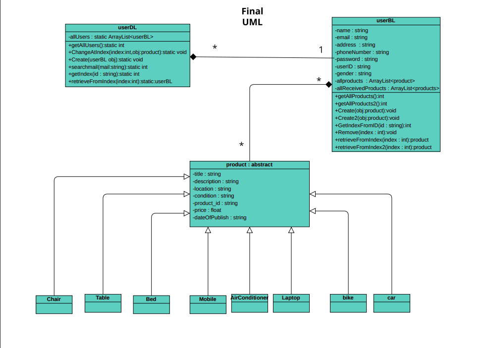
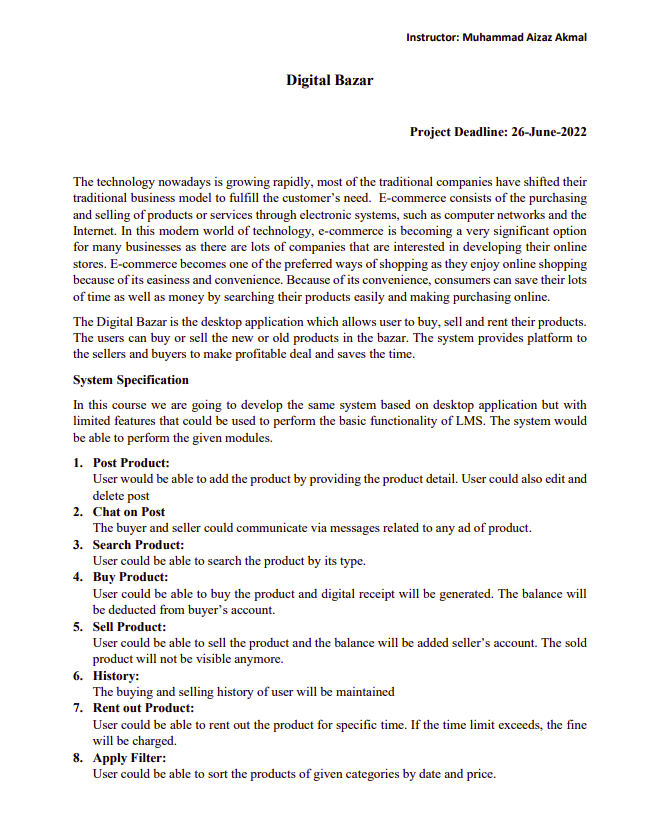
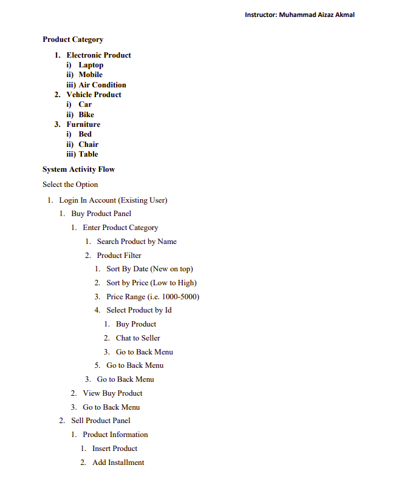
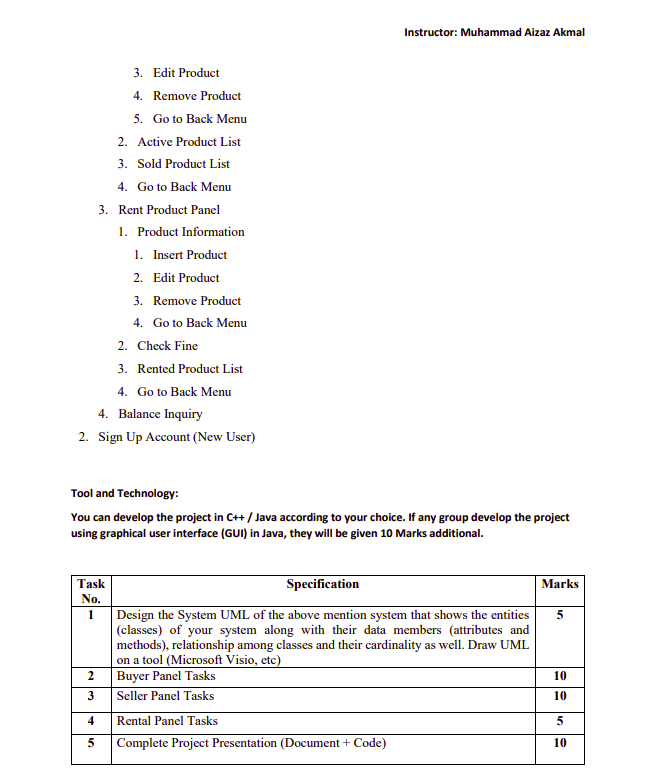

# Java Digital-Bazar-Object-Orientied-Proramming-2nd-Semester-Project
# Video Demo

<a href="https://www.youtube.com/watch?v=y0PmX2KlXVE&t=127s ">
   Video Demo Link</a>

# UML Diagram

# Project Statement 

# Getting Started 🚀

Start by clicking the green button in the upper right corner to download the code.

Clone the repository and navigate to the project directory
<li>
Run on IntelliJ IDEA
</li>
<li>
JDK 1.8 
</li>
   
# Contributing 🤝

I welcome contributions to this project! If you would like to contribute, please follow these steps:

 <li> Fork the repository and create a new branch for your changes. </li>
  <li> Make your changes and commit them with clear and descriptive messages.  </li>
  <li>Push your changes to your forked repository.   </li>
  <li>Create a pull request, describing your changes and why they should be merged into the main project.  </li>
   

Please make sure to follow our coding standards and best practices

# ScreenShoots
# Login Your Account If you have alraedy Account
 

# SignUp Your Account

 

 # Main Menu
  

 # User Information
 

 # Edit your Profile If you want need Changes 
 
  
 # Post Your Add Here 
 

# When Click on buy button

 # User History

# Authors 
<h2>🧑🏻 Ahsan Amin </h2>
            <h4>You can get in touch with me on my LinkedIn Profile:</h4>
            <li >
				<label>Linked In:<label><a href="https://www.linkedin.com/in/ahsan-amin-/">@linkedin </a>
			</li>
            <h4>You can also follow my GitHub Profile to stay updated about my latest projects</h4>
			<li >
				<label>GitHub:<label><a href="https://github.com/Ahsan-Amin">@github</a>
			</li>
		 
 If you liked the repo then kindly support it by giving it a star ⭐!

